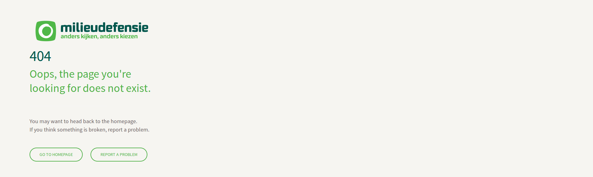

===============
vmd.error-sites
===============

Custom 404, 503 and maintenance pages for milieudefensie

Features
--------

- Responsive 
- Easy

Documentation
-------------

Full documentation for end users can be found in the "docs" folder.

Installation
------------

Just clone it to the place where you want it for example */srv/www/*

.. code-block::

	$ cd /srv/www
	$ git clone https://github.com/milieudefensie/vmd.error-sites.git

Make sure that the file is readable for your webserver user [www-data for example]

Contribute
----------

- Issue Tracker: https://github.com/milieudefensie/vmd.error-sites/issues
- Source Code: https://github.com/milieudefensie/vmd.error-sites

Support
-------

If you are having issues, please let us know.

License
-------

The project is licensed under the GPLv2. 
